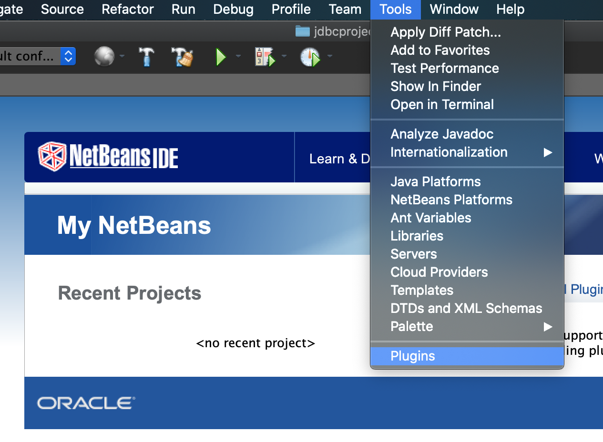
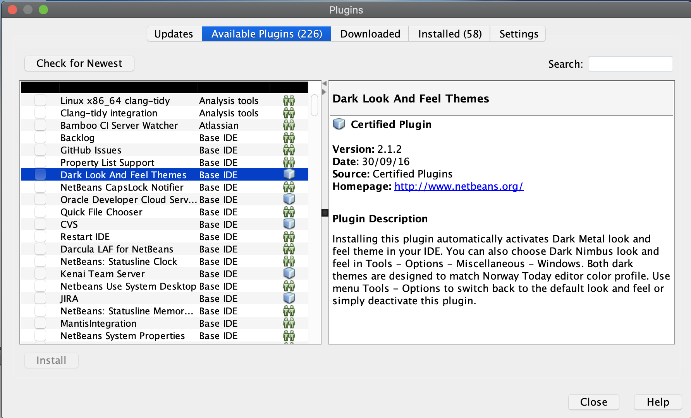
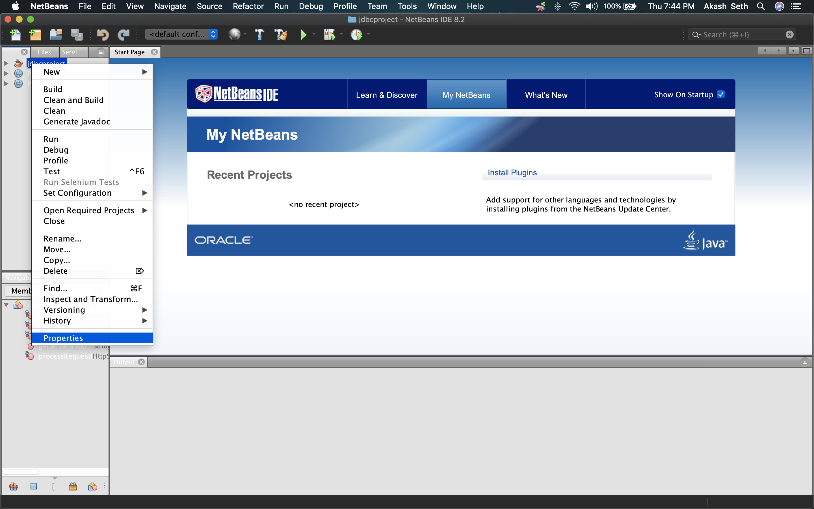
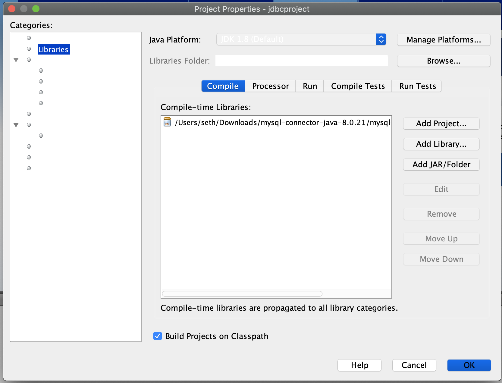

# Introduction

### Adding Plugins

#### Tools Menu -->Plugins


#### Plugins--> Add Plugins


#### Install Following Plugins
```Plugins
HTML5 Kit
JSF
SOAP Web Services
EJB and EAR
RESTful Web Services
Java EE Base
```
##### Source 
[plugins tutorial](https://dzone.com/articles/notes-on-java-eejakarta-ee-support-for-netbeans-9)

### Adding JAR FILE

#### Right click on the project --> Go to Properties



#### In Properties --> Go to Libraries


#### Click On ADD JAR and locate to add it --> then OK!!!!

### DONE
