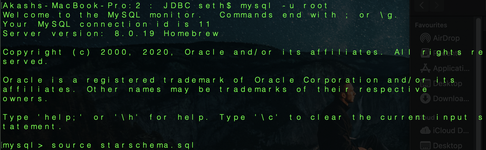

# Java DataBase Connectivity (Simple)

### Notes 

JDBC stands for Java Database Connectivity. 
JDBC is a Java API to connect and execute the query with the database.
 It is a part of JavaSE (Java Standard Edition). JDBC API uses JDBC drivers to connect with the database.


### SQL Database

#### To View The PORT in SQL
``` Port
SHOW GLOBAL VARIABLES LIKE 'PORT';
``` 
#### Essentials  for connection 
1. Username and Password (if any) of Database
2. Connection URL 
    ```url
        jdbc:sql://localhost:<PORT>/<Databse Name>
    ```
3. Driver Class 
    ```driver_class
        com.mysql.jdbc.driver
    ```
#### Adding Table in SQL 
To startup MySQL
```
mysql -u <username> -p
```


```Source
    source <filename with .sql extension>
```

#### STEPS :
1. Import Packages
```packages
    import java.sql.*;
```
2. Register JDBC Driver  
    Must be initialised to establish a communication  channel between  application and the database.
    Syntax :
    ```register_driver
            Class.forName(<driver class name>);
    ```
3. Open Connection 
    use DriverManager Class and it's Method getConnection() to create a connection object
    A connection is the session b/w the application program and the database.
    It is essential to doanything with database.
    Syntax : 
    ```Connection
        connection con= DriverManager.getConnection("<connection url>;"<username>","password");
    ```  
4. Execute Query 
    use Statement Class's object and it's Method createStatement() . 
    Requires object of type Statement  for building and submitting SQL Statement to the database.
    Syntax :
    ```Statement
        Statement stmt=con.createStatement();
    ```
   Types of Queries : 

   1. execute(String SQL Query) : Returns a boolean value of true if a ResultSet object can be retrieved; otherwise, it returns false. Use this method to execute SQL DDL statements or when you need to use the truly dynamic SQL.

   2. executeUpdate(String SQl Query): Returns the number of rows affected by the execution of the SQL statement. Use this method to execute SQL statements, for which you expect to get a number of rows affected - for example, an INSERT, UPDATE, or DELETE statement.

   3. executeQuery(String SQL): Returns a ResultSet object. Use this method when you expect to get a result set, as you would with a SELECT statement.
   
   Syntax :
    ```Resultset
        Resultset rs =stmt.<type_of_query>("<sql query>");
    ```

5. Extract Data (for Execute Query Only)
    Resultset's methods are used to retrive data  from the Resultset.
    Provides several methods to get column data for a row.
    Syntax For 'N' Rows: 
    ```Extract Data
        //.next() checks for the next row 
        while(rs.next()){
            //For string : getString()
            name=rs.getString("<Column_name>");
            //For any Datatype : get<Datatype>("<Column_name>") 
            prn=rs.getLong("PRN");
        }//End While
    ```  
    *For rest of the queries just validate  like 'if(rs){//Successful_statement}else{//Unsuccessful_statement}'*

6. Clean Up
    The enviornment requires explicitly closing all database resource using close() method.
    ```Cleanup
        rs.close();
        stmt.close();
        con.close();
    ```  
*try-catch will be used to handle exceptions in the code*

[CODE](jdbcproject.java)
### END
# Happy Coding !!!